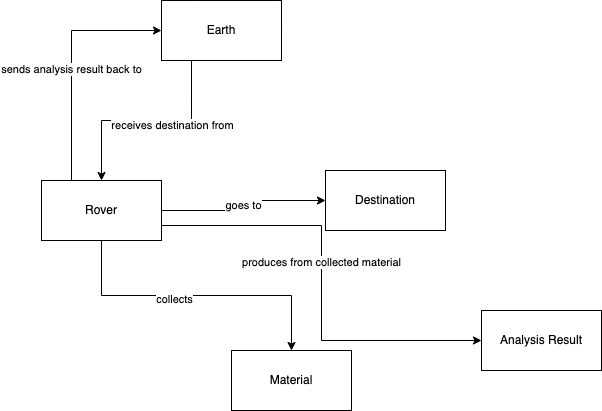
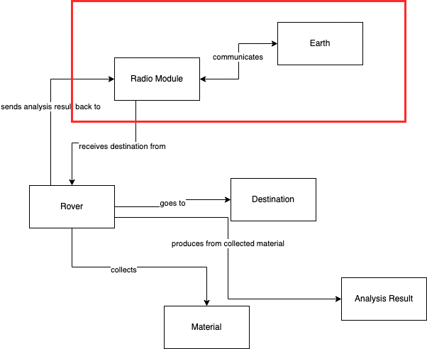
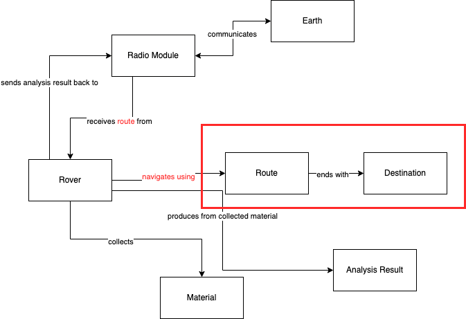
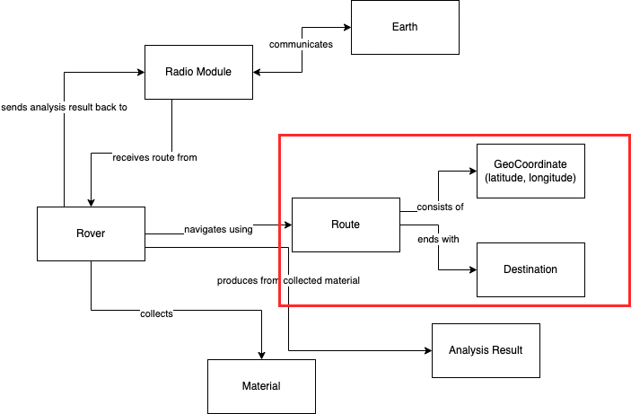
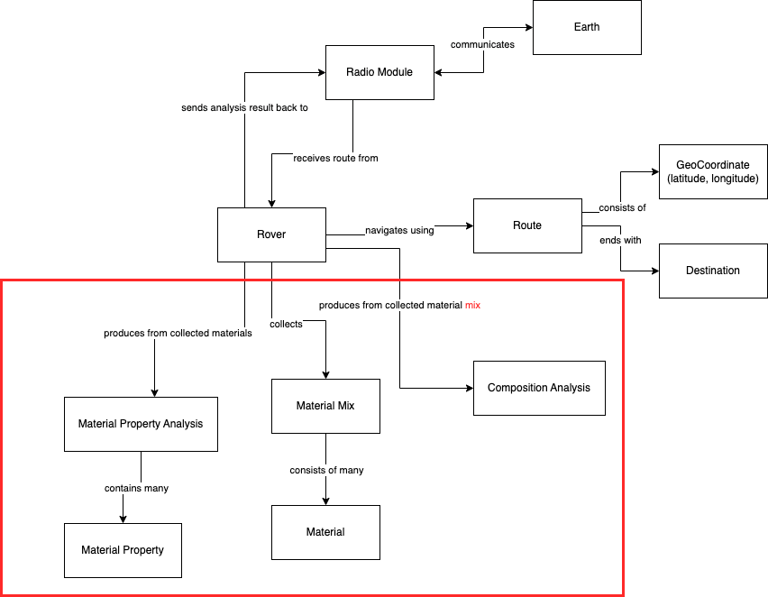

# Learning Hour: Domain-Driven Design - The Goal of DDD

Software engineering is frequently used for either automating existing business processes or solving difficult
real-world problems. In either case, it's not so much about the code, objects and methods, but it's about the concepts,
behaviors and structure of the problem space in the real-world.

This problem space is what you would call a domain.

For any useful application of software engineering, the domain is usually complex and difficult to understand for
people outside this domain.

If the software source code is using proper names and structured according to the 
knowledge from this business domain, then it should be possible for new developers to read the code and gain a deep
understanding of said domain. Additionally, it should be possible for domain experts to look at the code and be able
to relate to what's encoded in the software to what is happening in the domain.

That is the goal of Domain-Driven Design - to make sure that the source code reflects the business domain and that the
developers can learn the domain from the code, and the domain experts can read the code and communicate with the 
developers using the same language.

It's difficult to do. Majority of code bases out there don't have these properties, because the development group has
never bothered to extract the domain knowledge out of domain experts, or involve them in software design activities.

## Example domain knowledge extraction session

Let's imagine that you're a developer who just recently joined a company that is starting development of software for 
Mars rovers.

So you decide that you want to understand the domain better before you start software design and development. For that
you grab a domain expert to have a meeting with them - Domain Modeling workshop.

The domain expert starts talking about the Rover itself, and how it's going to receive instructions from earth on 
where to go, collect the material, perform its analysis and send the information back to earth.

You start drawing some boxes on the board:

As you draw this, you have a practical question to the expert:

"How would the Rover receive instructions from Earth and how would it communicate back?"

The expert tells you that you'll be using the Radio module for both communication channels. So you update the model:

Then you decide to ask: "How would the Rover know how to reach the destination?"

The expert thinks for a moment, and gives you new information:

- There will be actually many Rovers on the surface of Mars, and we should be careful to not have them collide or
  interfere with each other.
- That's why their pathing to destination would actually have to be planned back on Earth, automatically and sometimes
  with intervention of people. That means that the Rover will actually receive a Route to the destination, not only
  the destination.

So you process what you've just heard and adjust your diagram accordingly:

As you keep thinking about the last change, you still lack full understanding how the Rover will navigate exactly, so
you probe more on this:

"What will this route consist of?"

The expert's response is simple: it's just many coordinates that the Rover should visit. Each coordinate is represented
by a latitude and longitude.

So you update your diagram again to reflect this new knowledge:

Running out of questions about the route and destination, you draw your gaze towards the Material concept. You think a
bit about it: there must be multiple different materials where the Rover will be once it reaches its destination. So
you ask:

"There must be multiple materials that can be collected at all times. What Rover will actually collect and analyze?"

The expert has to think hard about it, because it's obvious to them, but hey, that's why they are the expert. So the
summary of their response is:

- It's going to be a mix of different materials that is collected.
- Rover will collect whatever it gets at the destination.
- It'll run the analysis on this mix of materials and will identify what different materials are in the mix, and
  produce multiple analysis results:
  - One analysis on which materials are in the mix and in which composition.
  - Many analysis per each material on the key material property.

So you make another huge update of your diagram:

The session didn't end here (the domain is very complex), but it's enough for the purposes of our example.

Now it's time to practice this!

## Kata: Domain Modeling Workshop

1. Grab a domain expert in your business
2. Ask them to describe the problem space
3. Model this problem space iteratively by asking more clarifying questions
4. Actively get their feedback if the model that you're producing is correctly reflecting their expertise
